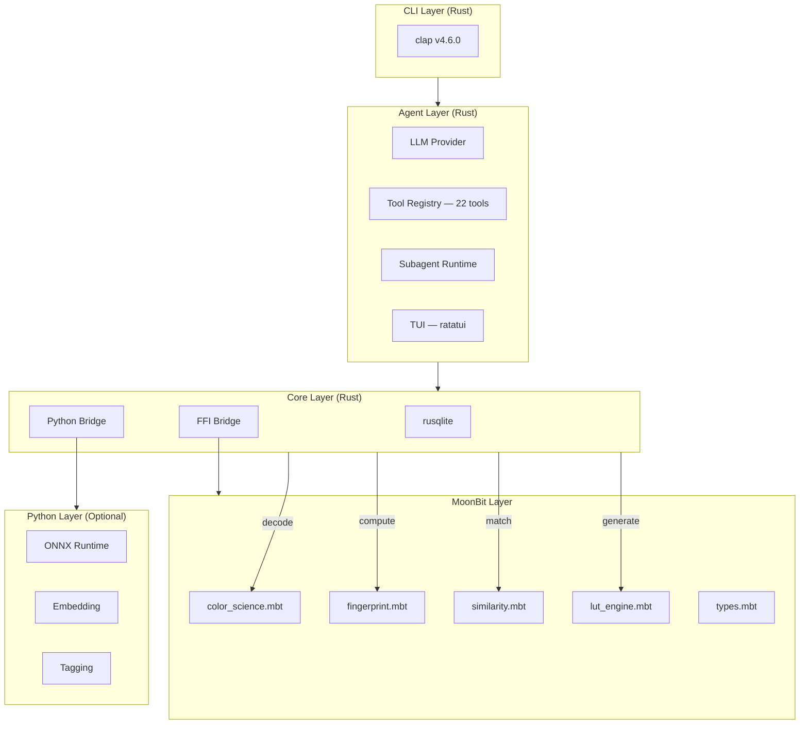
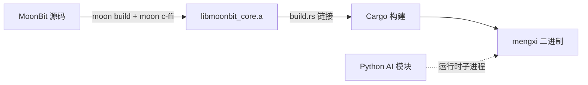

# Mengxi (梦溪)

> 2026 MoonBit 软件合成挑战赛参赛项目

面向数字中间片流程的命令行调色管线管理平台。Mengxi 帮助调色指导通过图像相似度匹配检索历史项目库，并将匹配的调色风格导出为 LUT 文件，一键嵌入 DaVinci Resolve 使用。

**English version: [README_EN.md](README_EN.md)**

## Table of Contents

- [The Problem](#the-problem)
- [Features](#features)
- [Architecture](#architecture)
- [Project Structure](#project-structure)
- [Installation](#installation)
- [Usage](#usage)
- [Configuration](#configuration)
- [Development](#development)
- [Roadmap](#roadmap)
- [Contributing](#contributing)
- [License](#license)
- [Author](#author)

## The Problem

当客户描述一种期望的画面氛围时，调色通常需要手动将描述转化为技术参数，每次沟通约 30 分钟的创作瓶颈。现有工具（包括 DaVinci Resolve 自带的项目库、Gallery 和 PowerGrade）均不支持标签化的调色风格搜索或语义检索。

**Mengxi 将定调与沟通时间从 30 分钟缩短至 1 分钟以内。**

## Features

- **项目导入** — 导入 DPX/EXR/MOV 项目文件夹，自动识别格式、提取关键帧和色彩指纹
- **色彩指纹提取** — 提取丰富的色彩元数据（直方图、色彩空间分布、关键帧特征），存入本地嵌入式数据库
- **基于图像的相似度搜索** — 上传参考图片，通过直方图匹配和 AI 向量嵌入，返回 Top-N 匹配结果
- **LUT 导出** — 将匹配的风格导出为 `.cube`、`.3dl`、`.look`、`.csp` 和 ASC-CDL 格式的 LUT 文件，可直接导入 DaVinci Resolve
- **LUT 版本管理** — LUT 文件差异对比和依赖关系追踪
- **人机协同标签校准** — AI 自动生成语义标签，调色师修正后系统持续学习优化
- **命令行界面** — 10 个子命令，支持交互模式和脚本批处理模式，支持文本表格和 JSON 两种输出格式
- **智能对话代理** — `mengxi chat` 启动内置 AI 代理，通过自然语言交互完成搜索、分析和 LUT 编辑。支持 Claude、OpenAI、Ollama 三种 LLM 后端，配备 22 个工具和 4 个子代理
- **LUT 智能编辑** — 在对话代理中加载、编辑、对比 LUT，支持 6 种调色操作（lift/gain/gamma/offset/saturation/hue_shift），按明度区域（shadows/midtones/highlights）选择性编辑，带 hash 锚验证和 undo 栈

## Architecture

Mengxi 采用三层语言架构，各取所长：



| 层 | 语言 | 职责 |
|----|------|------|
| **CLI 外壳、系统 I/O** | Rust | CLI 入口、TUI 界面、文件格式解码（DPX/EXR/MOV）、数据库操作、Python 子进程管理 |
| **Agent 层** | Rust | LLM 对话代理（Claude/OpenAI/Ollama）、22 个工具（搜索/分析/项目管理/LUT 编辑）、4 个子代理、会话持久化 |
| **核心算法** | MoonBit | 色彩科学（ACES 1.3）、指纹计算、相似度搜索、LUT 生成/对比、类型安全的色彩空间封装 |
| **AI 推理** | Python | ONNX Runtime 向量嵌入生成、AI 标签生成、校准学习循环 |

### 关键设计决策

- **FFI 边界**：图像像素数据不跨越 FFI——仅传递预计算的数值数组
- **类型安全的色彩空间**：MoonBit 类型系统在编译期强制区分 Linear/Log/Video，从根源上杜绝一整类色彩科学 bug
- **嵌入式 SQLite**：单文件数据库，WAL 模式，零外部依赖
- **Python 可选**：AI 功能可优雅降级；无 Python 环境时工具仍完全可用（导入、指纹、直方图搜索、LUT 导出均可正常工作）
- **Provider-agnostic 代理**：`ProviderFactory` 抽象使支持新 LLM 后端只需实现两个 trait，无需修改已有代码

## Project Structure

```
mengxi/
├── Cargo.toml              # Rust workspace 根配置
├── build.rs                # 通过 FFI 链接 libmoonbit_core.a
├── migrations/             # SQL 迁移文件（启动时自动执行）
│   ├── 001_create_projects.sql
│   ├── 002_create_fingerprints.sql
│   ├── 003_create_tags.sql
│   ├── 004_create_luts.sql
│   ├── 005_create_search_feedback.sql
│   ├── 006_create_analytics.sql
│   └── 007_create_calibration.sql
├── crates/
│   ├── cli/                # CLI 入口（10 个子命令）+ TUI 界面
│   ├── agent/              # AI 对话代理（LLM 集成、工具系统、子代理、会话管理）
│   ├── core/               # 领域逻辑、数据库、Python 桥接、分析统计
│   └── format/             # 格式解码器（DPX, EXR, MOV, LUT, PowerGrade）
├── moonbit/                # MoonBit 核心算法
│   └── src/                # color_science, fingerprint, similarity, lut_engine, types
├── python/                 # AI 推理子进程（可选）
│   ├── requirements.txt
│   └── mengxi_ai/          # main.py, embedding.py, tagging.py, models.py
└── tests/                  # 跨语言集成测试
```

## Installation

### 前置要求

| 依赖 | 版本 | 说明 | 必须 |
|------|------|------|------|
| [Rust](https://rustup.rs/) | nightly | 系统语言、CLI 框架、数据库 | 是 |
| [MoonBit](https://moonbitlang.com/) | v0.8.x | 核心算法编译工具链 | 是 |
| [Python](https://www.python.org/) | 3.11+ | AI 推理运行时 | 否（AI 功能需要） |

### 构建步骤

```bash
# 克隆仓库
git clone https://github.com/MaoDingA/mengxi.git
cd mengxi

# 构建 MoonBit 核心算法库
cd moonbit && moon build && moon c-ffi && cd ..

# 构建 Rust 项目（自动链接 MoonBit 静态库）
cargo build --release

# 可选：安装 Python AI 依赖
pip install -r python/requirements.txt
```

构建产物为单个二进制文件 `target/release/mengxi`。

## Usage

### 导入项目

```bash
# 导入 DPX 项目文件夹
mengxi import /path/to/project --name "X项目-日夜戏"

# 导入单个 EXR 文件
mengxi import /path/to/scene.exr --name "夜晚外景"

# 指定输出格式（交互模式 / JSON 模式）
mengxi import /path/to/project --name "项目名" --output json
```

### 搜索相似色彩风格

```bash
# 以参考图片搜索
mengxi search /path/to/reference.png --top 5

# 按标签搜索
mengxi search --tags "暖色调,夜晚,外景" --limit 10

# 在特定项目范围内搜索
mengxi search /path/to/reference.png --project "X项目" --top 3
```

### 导出 LUT

```bash
# 导出为 .cube 格式（DaVinci Resolve 通用）
mengxi export --match 1 --format cube --output style.cube

# 导出为 .3dl 格式
mengxi export --match 1 --format 3dl --output style.3dl

# 导出为 ASC-CDL 格式
mengxi export --match 1 --format cdl --output style.cdl
```

### LUT 管理

```bash
# 对比两个 LUT 文件的差异
mengxi lut-diff version_a.cube version_b.cube

# 查看 LUT 依赖关系（哪个 LUT 被应用到哪个项目）
mengxi lut-dep style.cube
```

### 标签管理

```bash
# 查看项目标签
mengxi tag --project "X项目-日夜戏"

# 添加标签
mengxi tag --project "X项目-日夜戏" --add "科幻,冷色调"

# 修正 AI 标签（触发校准学习）
mengxi tag --project "X项目-日夜戏" --fix "夜晚" --to "黄昏"
```

### 其他命令

```bash
# 查看指纹详情
mengxi info --project "X项目-日夜戏"

# 查看使用统计
mengxi stats

# 管理配置
mengxi config --show
```

### 智能对话代理

```bash
# 启动 AI 代理（默认使用 Claude）
mengxi chat

# 使用 Ollama 本地模型
mengxi chat --provider ollama

# 指定 OpenAI 模型
mengxi chat --provider openai --model gpt-4o
```

代理内置 22 个工具，支持自然语言交互：

| 类别 | 工具 | 说明 |
|------|------|------|
| 搜索 | `search_by_image`, `search_by_tag`, `search_by_color`, `search_similar`, `search_similar_region` | 图像/标签/颜色/区域搜索 |
| 分析 | `analyze_project`, `compare_styles`, `get_fingerprint_info` | 项目分析、风格对比、指纹详情 |
| 管理 | `list_projects`, `import_project`, `reextract_features`, `export_lut` | 项目列表、导入、重提取、LUT 导出 |
| LUT 编辑 | `load_lut`, `edit_lut`, `save_lut`, `undo_lut_edit`, `diff_lut`, `render_lut_curves` | LUT 加载/编辑/保存/撤销/对比/曲线渲染 |

代理还会根据任务自动启动子代理（explore、search、review、compare）进行并行处理。

## Configuration

所有配置通过 `~/.mengxi/config` TOML 文件管理，首次运行时自动创建。

```toml
[search]
default_limit = 5
similarity_threshold = 0.75

[python]
idle_timeout = 300        # Python 子进程空闲超时（秒）
model_path = "~/.mengxi/models/"

[import]
keyframe_interval = 10    # 关键帧提取间隔（秒）
```

修改配置后下次 CLI 调用即生效，无需重新编译。

## Development

### 开发环境搭建

```bash
# 安装 Rust nightly
rustup default nightly

# 安装 MoonBit 工具链
curl -fsSL https://moonbitlang.com/install | bash

# 克隆并构建
git clone https://github.com/MaoDingA/mengxi.git
cd mengxi
cargo build
```

### 运行测试

```bash
# Rust 单元测试 + 集成测试（807 tests）
cargo test

# FFI 边界测试
cargo test --test ffi_tests

# CLI 端到端测试
cargo test --test cli_tests

# Python 协议测试（需要 Python 环境）
python -m pytest python/tests/
```

### 代码约定

| 领域 | 约定 | 示例 |
|------|------|------|
| Rust 函数/变量 | snake_case | `compute_fingerprint` |
| Rust 类型/特征 | PascalCase | `Fingerprint` |
| MoonBit 函数 | snake_case | `apply_aces_transform` |
| MoonBit 类型 | PascalCase | `LinearRGB` |
| Python 函数/变量 | PEP 8 snake_case | `generate_embedding` |
| 数据库表 | snake_case 复数 | `projects`, `fingerprints` |
| FFI 导出函数 | `mengxi_` 前缀 | `mengxi_compute_fingerprint` |
| CLI 子命令 | 单词小写 | `import`, `search`, `lut-diff` |
| CLI 标志 | kebab-case | `--search-limit` |
| JSON 协议键 | snake_case | `request_id`, `image_path` |
| 错误码 | CATEGORY_DETAIL | `IMPORT_CORRUPT_FILE` |

### 构建流程



1. MoonBit 编译为静态库 `libmoonbit_core.a`
2. `build.rs` 将静态库链接到 Rust 二进制
3. Cargo 构建所有 Rust crates，输出单个 `mengxi` 可执行文件
4. Python 不是构建依赖——仅在运行时作为子进程按需启动


## Roadmap

| 阶段 | 重点 | 状态 |
|------|------|------|
| **v1 — MVP** | 核心 7 项功能——导入、指纹、搜索、导出、LUT 对比、标签校准、CLI | ✅ 完成 |
| **v2 — 算法增强** | ACES 1.3 色彩管线、CDL 参数提取、PowerGrade 支持、增量索引 | ✅ 完成 |
| **v3 — 规模与智能** | 区域搜索、特征增强、分析统计、gRPC 接口 | ✅ 完成 |
| **v5 — 智能代理** | AI 对话代理、22 工具、4 子代理、TUI 界面、LUT 智能编辑、会话持久化 | ✅ 完成 |
| **v4 — 区域搜索** | 区域级别特征提取与匹配、空间感知搜索 | 🔜 计划中 |

## Contributing

欢迎共创代码：

1. Fork 本仓库
2. 创建功能分支（`git checkout -b feature/your-feature`）
3. 进行开发并编写测试
4. 确保所有测试通过（`cargo test`）
5. 提交 Pull Request

## License

本项目基于 [MIT 许可证](LICENSE) 开源。