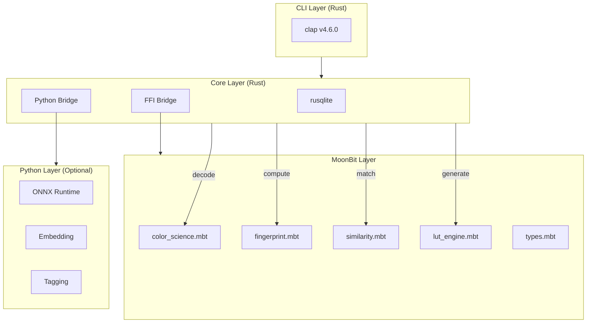
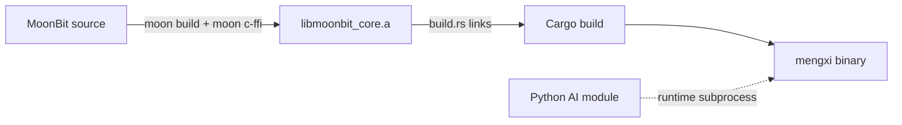

# Mengxi (梦溪)

A CLI-based color pipeline management platform for professional film/TV post-production (Digital Intermediate / DI) workflows. Mengxi helps colorists search their historical project library via image-based similarity matching and export matching styles as LUT files for DaVinci Resolve.

**中文版：[README.md](README.md)**

## Table of Contents

- [The Problem](#the-problem)
- [Features](#features)
- [Architecture](#architecture)
- [Project Structure](#project-structure)
- [Installation](#installation)
- [Usage](#usage)
- [Configuration](#configuration)
- [Development](#development)
- [Roadmap](#roadmap)
- [Contributing](#contributing)
- [License](#license)
- [Author](#author)

## The Problem

When a director describes a desired visual tone, a colorist traditionally must manually translate that into technical parameters — a ~30-minute creative bottleneck per session. No existing tool (including DaVinci Resolve's own Project Library, Gallery, and PowerGrade features) provides cross-project color style search or semantic retrieval.

**Mengxi reduces tone-setting time from ~30 minutes to under 1 minute.**

## Features

- **Project Import** — Import DPX/EXR/MOV project folders with automatic format detection, keyframe extraction, and color fingerprint extraction
- **Color Fingerprint Extraction** — Extract rich color metadata (histograms, color space distribution, keyframe characteristics) into a local embedded database
- **Image-Based Similarity Search** — Upload a reference image and receive top-N ranked matching results using histogram matching and AI embeddings
- **LUT Export** — Export matching styles as `.cube`, `.3dl`, `.look`, `.csp`, and ASC-CDL format LUT files, loadable directly in DaVinci Resolve
- **LUT Version Control** — Diff comparison between LUT files and dependency tracking
- **Human-AI Tag Calibration** — AI-generated semantic tags with colorist correction feedback loop
- **CLI Interface** — 9 commands (`import`, `search`, `export`, `info`, `tag`, `lut-diff`, `lut-dep`, `stats`, `config`) with interactive and scripted modes, text table and JSON output formats

## Architecture

Mengxi uses a three-layer language architecture, each chosen for its strengths:



| Layer | Language | Role |
|-------|----------|------|
| **CLI Shell, System I/O, FFI Bridge** | Rust | CLI entry point, file format decoding (DPX/EXR/MOV), database operations, Python subprocess management |
| **Core Algorithms** | MoonBit | Color science (ACES 1.3), fingerprint computation, similarity search, LUT generation/diff, type-safe color space wrappers |
| **AI Inference** | Python | ONNX Runtime embedding generation, AI tag generation, calibration learning loop |

### Key Design Decisions

- **FFI boundary**: Image pixel data never crosses FFI — only pre-computed numeric arrays
- **Type-safe color spaces**: MoonBit's type system enforces Linear/Log/Video distinction at compile time, preventing an entire class of color science bugs
- **Embedded SQLite**: Single-file database with WAL mode, zero external dependencies
- **Python is optional**: AI features degrade gracefully; the tool is fully functional without a Python environment (import, fingerprint, histogram search, and LUT export all work standalone)

## Project Structure

```
mengxi/
├── Cargo.toml              # Rust workspace root
├── build.rs                # Links libmoonbit_core.a via FFI
├── migrations/             # SQL migrations (auto-executed on startup)
│   ├── 001_create_projects.sql
│   ├── 002_create_fingerprints.sql
│   ├── 003_create_tags.sql
│   ├── 004_create_luts.sql
│   ├── 005_create_search_feedback.sql
│   ├── 006_create_analytics.sql
│   └── 007_create_calibration.sql
├── crates/
│   ├── cli/                # CLI entry point (9 subcommands)
│   ├── core/               # Domain logic, DB, Python bridge, analytics
│   └── format/             # Format decoders (DPX, EXR, MOV, LUT, PowerGrade)
├── moonbit/                # MoonBit core algorithms
│   └── src/                # color_science, fingerprint, similarity, lut_engine, types
├── python/                 # AI inference subprocess (optional)
│   ├── requirements.txt
│   └── mengxi_ai/          # main.py, embedding.py, tagging.py, models.py
└── tests/                  # Cross-language integration tests
```

## Installation

### Prerequisites

| Dependency | Version | Description | Required |
|------------|---------|-------------|----------|
| [Rust](https://rustup.rs/) | nightly | System language, CLI framework, database | Yes |
| [MoonBit](https://moonbitlang.com/) | v0.8.x | Core algorithm toolchain | Yes |
| [Python](https://www.python.org/) | 3.11+ | AI inference runtime | No (AI features only) |

### Build Steps

```bash
# Clone the repository
git clone https://github.com/MaoDingA/mengxi.git
cd mengxi

# Build MoonBit core algorithm library
cd moonbit && moon build && moon c-ffi && cd ..

# Build Rust project (automatically links MoonBit static library)
cargo build --release

# Optional: install Python AI dependencies
pip install -r python/requirements.txt
```

Build output is a single binary at `target/release/mengxi`.

## Usage

### Import Projects

```bash
# Import a DPX project folder
mengxi import /path/to/project --name "Wandering Earth 2 - Day Night"

# Import a single EXR file
mengxi import /path/to/scene.exr --name "Night Exterior"

# Specify output format (interactive / JSON mode)
mengxi import /path/to/project --name "Project Name" --output json
```

### Search Similar Color Styles

```bash
# Search by reference image
mengxi search /path/to/reference.png --top 5

# Search by tags
mengxi search --tags "warm,night,exterior" --limit 10

# Search within a specific project
mengxi search /path/to/reference.png --project "Wandering Earth 2" --top 3
```

### Export LUTs

```bash
# Export as .cube format (DaVinci Resolve compatible)
mengxi export --match 1 --format cube --output style.cube

# Export as .3dl format
mengxi export --match 1 --format 3dl --output style.3dl

# Export as ASC-CDL format
mengxi export --match 1 --format cdl --output style.cdl
```

### LUT Management

```bash
# Compare two LUT files
mengxi lut-diff version_a.cube version_b.cube

# View LUT dependencies (which LUT is applied to which project)
mengxi lut-dep style.cube
```

### Tag Management

```bash
# View project tags
mengxi tag --project "Wandering Earth 2 - Day Night"

# Add tags
mengxi tag --project "Wandering Earth 2 - Day Night" --add "sci-fi,cold"

# Correct AI tags (triggers calibration learning)
mengxi tag --project "Wandering Earth 2 - Day Night" --fix "night" --to "dusk"
```

### Other Commands

```bash
# View fingerprint details
mengxi info --project "Wandering Earth 2 - Day Night"

# View usage statistics
mengxi stats

# Manage configuration
mengxi config --show
```

## Configuration

All configuration is managed through `~/.mengxi/config` (TOML format). The file is auto-created on first run.

```toml
[search]
default_limit = 5
similarity_threshold = 0.75

[python]
idle_timeout = 300        # Python subprocess idle timeout (seconds)
model_path = "~/.mengxi/models/"

[import]
keyframe_interval = 10    # Keyframe extraction interval (seconds)
```

Configuration changes take effect on the next CLI invocation without recompilation.

## Development

### Setting Up the Development Environment

```bash
# Install Rust nightly
rustup default nightly

# Install MoonBit toolchain
curl -fsSL https://moonbitlang.com/install | bash

# Clone and build
git clone https://github.com/MaoDingA/mengxi.git
cd mengxi
cargo build
```

### Running Tests

```bash
# Rust unit tests + integration tests
cargo test

# FFI boundary tests
cargo test --test ffi_tests

# CLI end-to-end tests
cargo test --test cli_tests

# Python protocol tests (requires Python environment)
python -m pytest python/tests/
```

### Code Conventions

| Domain | Convention | Example |
|--------|------------|---------|
| Rust functions/variables | snake_case | `compute_fingerprint` |
| Rust types/traits | PascalCase | `Fingerprint` |
| MoonBit functions | snake_case | `apply_aces_transform` |
| MoonBit types | PascalCase | `LinearRGB` |
| Python functions/variables | PEP 8 snake_case | `generate_embedding` |
| Database tables | snake_case plural | `projects`, `fingerprints` |
| FFI exported functions | `mengxi_` prefix | `mengxi_compute_fingerprint` |
| CLI subcommands | single lowercase word | `import`, `search`, `lut-diff` |
| CLI flags | kebab-case | `--search-limit` |
| JSON protocol keys | snake_case | `request_id`, `image_path` |
| Error codes | CATEGORY_DETAIL | `IMPORT_CORRUPT_FILE` |

### Build Pipeline



1. MoonBit compiles to a static library `libmoonbit_core.a`
2. `build.rs` links the static library into the Rust binary
3. Cargo builds all Rust crates, outputting a single `mengxi` executable
4. Python is not a build dependency — it runs as a runtime subprocess on demand

## Development Status

**Planning complete, implementation in progress.**

- [x] Product Requirements Document (PRD)
- [x] Architecture Design (41 FR + 18 NFR)
- [x] Epics & Stories (5 epics, 21 stories)
- [ ] Sprint 1: CLI Foundation & Project Import
- [ ] Sprint 2: Fingerprint Engine & Search
- [ ] Sprint 3: LUT Engine & Export
- [ ] Sprint 4: AI-Enhanced Tags & Calibration
- [ ] Sprint 5: Analytics & Reporting

## Roadmap

| Phase | Focus |
|-------|-------|
| **MVP** | Core 7 features — import, fingerprint, search, export, LUT diff, tag calibration, CLI |
| **Growth** | Natural language search, incremental indexing, gRPC DaVinci integration, TUI dashboard |
| **Expansion** | GUI interface, style analysis/teaching, DIT on-set integration, streaming platform audit |

## Contributing

Contributions are welcome. Please follow these steps:

1. Fork the repository
2. Create a feature branch (`git checkout -b feature/your-feature`)
3. Make your changes and write tests
4. Ensure all tests pass (`cargo test`)
5. Open a Pull Request

## License

This project is licensed under the [MIT License](LICENSE).

## Author

**Mao Ding (毛丁)**
